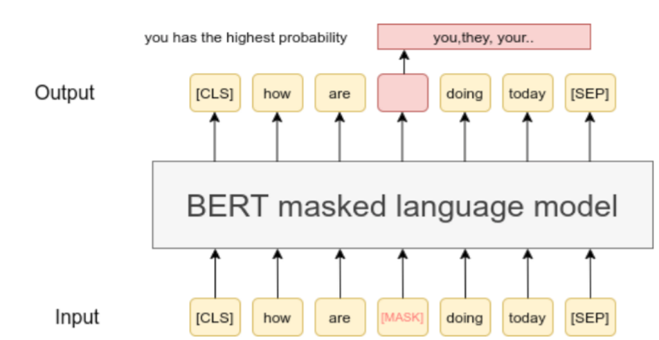
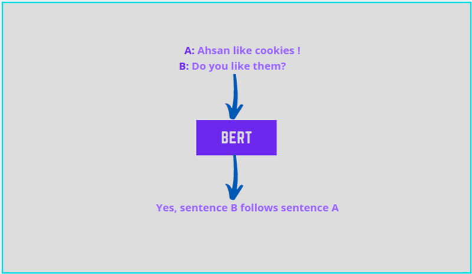
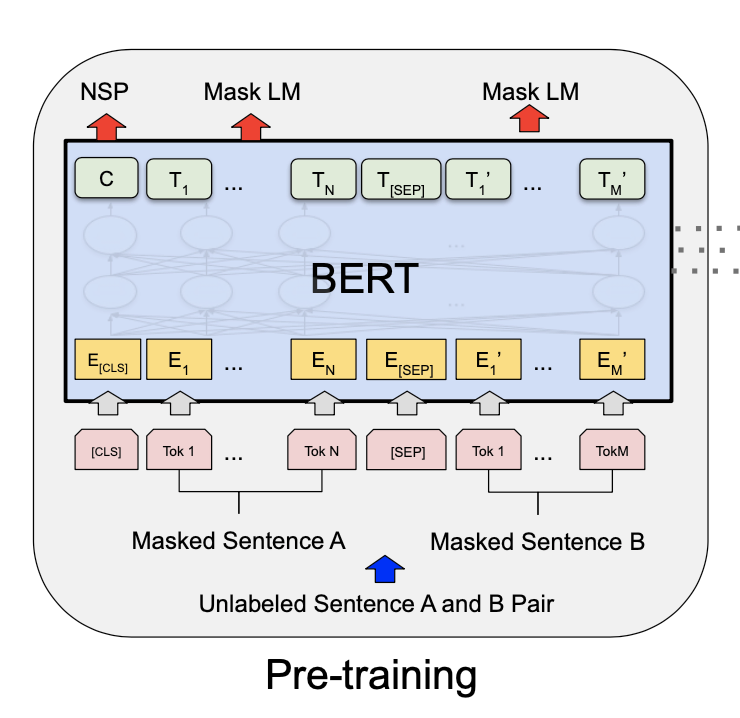
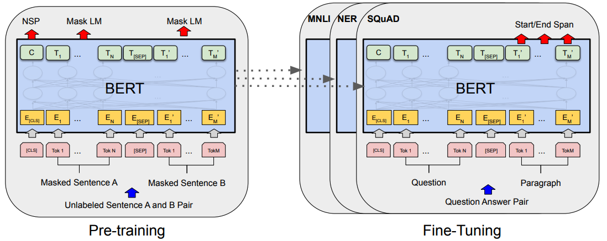

### 1. What is BERT?
BERT, which stands for Bidirectional Encoder Representations from Transformers, is a game-changer in the realm of NLP. Developed by Google, BERT is all about understanding the context of words in a sentence—something that previous models struggled with.

Let's break it down:

* Bidirectional: BERT reads text both forward and backward. This allows it to understand context from both ends of the sentence, not just from left to right or right to left.

* Encoder Representations: BERT uses encoders to transform words into numerical vectors that machines can understand. This is how it deciphers the context of words.

* Transformers: A type of model that uses self-attention mechanisms, meaning it pays attention to all the words in the sentence when understanding the context of a particular word.

* In simpler terms, BERT is essentially a language detective. It doesn't just look at words—it delves into the hidden depths of language to understand the meaning behind words based on their context.

### BERT Pre-Training

### 2. How BERT works: A simplified explanation

Now that you have a basic understanding of what BERT is, let's dive a bit deeper into how this fascinating model works. How does BERT actually figure out the context of each individual word it reads? Let's break it down into simple steps:

* Input Embedding: First, BERT takes your sentence and converts it into tokens, which are essentially smaller chunks of the sentence. Then, it embeds these tokens into vectors using an embedding layer.
  
* Self-Attention Mechanism: Here's where the magic happens. BERT uses a mechanism called "self-attention" to weigh the importance of each token in relation to all the other tokens in the sentence. This means that each word is considered in the context of the entire sentence—not just the words immediately before or after it.

* Encoder Layers: These layers are where BERT really gets to work. It passes the weighted vectors through multiple transformer encoder layers—each of which helps BERT understand the sentence better.

*  Output: After going through all the layers, BERT produces a vector for each token that represents that token's context within the sentence.

To put it in a nutshell, BERT works by breaking down sentences, weighing the importance of each word in relation to the others, and using those weights to better understand the sentence as a whole. It's like a symphony conductor making sure every instrument plays its part in harmony with the rest. So, if you want your NLP model to have a keen ear for context, BERT might be the maestro you need.

### 3. Practical tips for using BERT
Moving on from the theory, let's get down to business. How do you actually use BERT in real life? Here are some practical tips that will help you get started and make the most of this powerful tool.

* Use Pre-trained Models: One of the biggest advantages of BERT is that it comes with a set of pre-trained models. So, you don't have to start from scratch. These models have been trained on a vast amount of text data and can be fine-tuned to suit your specific needs. It's like getting a leg up from BERT itself!

* Fine-tune with Care: When fine-tuning your BERT model, remember, it's a delicate balance. You want to adjust the model to suit your specific task, but over-tuning can lead to poor performance. It's like cooking—too much spice can ruin the dish.

* Take Advantage of BERT's Context Understanding: Remember that BERT's superpower is understanding the context of words. So, design your NLP tasks in a way that leverages this strength. For instance, BERT is great for tasks like question answering or sentiment analysis where context is key.

* Experiment with Different Versions: BERT comes in different versions—base, large, and even multilingual. Each version has its strengths and weaknesses. So, don't be afraid to experiment with different versions to see which works best for your task. Furthermore, there exist many iterations of BERT such as RoBERTa and DistilBERT which come with their own unique advantages.

Using BERT is like driving a high-performance car—it takes some practice to handle, but once you get the hang of it, you'll be able to navigate the tricky terrain of NLP with ease!

### 4. Techniques for optimizing BERT performance
Alright, by now you've got your hands on the steering wheel, so how do you ensure that your BERT model runs like a well-oiled machine? Here are a few techniques for optimizing its performance:

* Batch Size and Learning Rate: These are two hyperparameters that you can play around with. A larger batch size can lead to more stable gradients, but at the cost of increased memory usage. The learning rate, on the other hand, can be adjusted to avoid large jumps in the model's weights during training. Remember, it's all about finding the sweet spot!

* Early Stopping: This technique helps avoid overfitting. How does it work? You just stop the model's training when the performance on a validation set stops improving. It's like knowing when to leave the party—before things start to go downhill.

* Gradient Accumulation: This is a handy technique for training large models on limited hardware. It simply allows you to accumulate gradients over multiple mini-batches before updating the model's parameters.

* Model Pruning: Here's a technique where less is more. By pruning, or removing, less important connections in the model, you can reduce its size and computational needs without a significant drop in performance. Such changes improve efficiency.

Optimizing a BERT model is like tuning a musical instrument. You've got to tweak the right parameters and techniques to hit the perfect note. And with these techniques, you'll be playing sweet music with BERT in no time!
